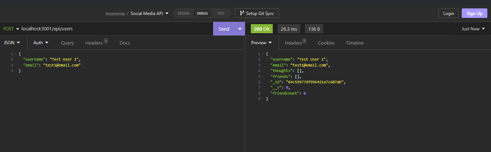

# SocialApi

## Description

This is a backend for a social media platform. It has a MongoDB based database for users, friends, thoughts, and reactions. There are api routes to perform RESTful CRUD operations with the ability to create, update, and delete entries in the database.

## Screenshot

Video Walkthrough:
https://drive.google.com/file/d/1WF-NElLtaC_rsIDY_L_Vd64WaTBqsmaN/view?usp=sharing
